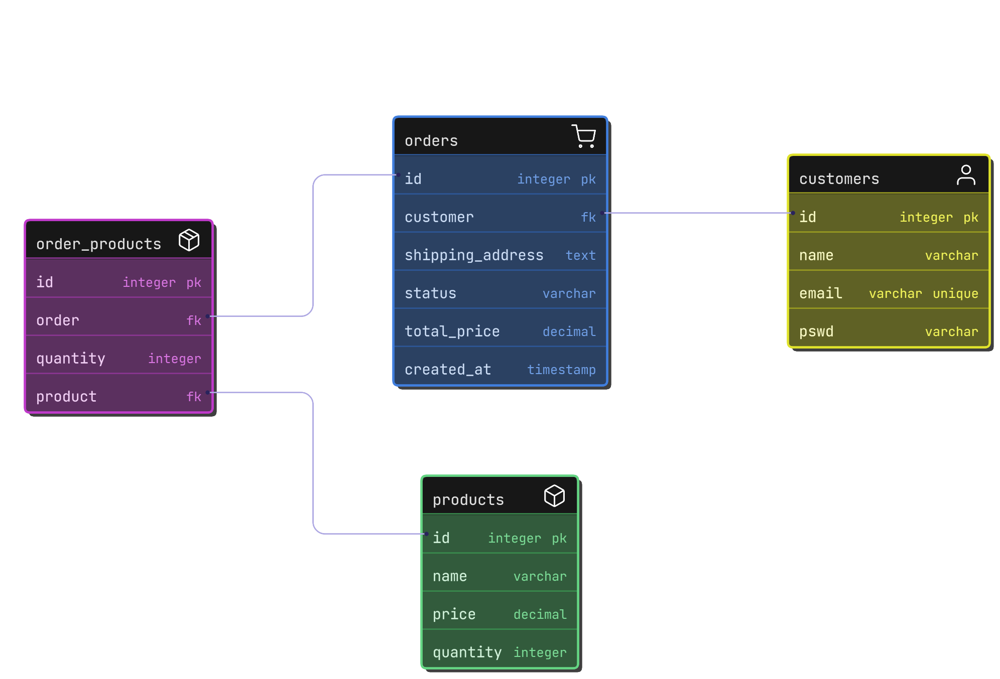

```markdown
## Running the Project with Docker

To run this project using Docker, follow the steps below:

### Prerequisites

Ensure you have Docker and Docker Compose installed on your system. The project uses the following Docker images:

- Node.js version `22.13.1-slim` for the application.
- PostgreSQL `latest` for the database.

### Environment Variables

The application requires the following environment variables:

- `NODE_ENV`: Set to `production`.
- `PORT`: The port on which the application will run (default: `3000`).
- Database service:
  - `POSTGRES_USER`: Database username.
  - `POSTGRES_PASSWORD`: Database password.
  - `POSTGRES_DB`: Database name.

### Steps to Build and Run

1. Clone the repository and navigate to the project directory.
2. Build and start the services using Docker Compose:

   ```bash
   docker-compose up --build
   ```

3. Access the application at `https://order-app-c5vdzevwdq-el.a.run.app`.

### Exposed Ports

- Application: `8080` (mapped to host `8080`).
- Database: Not exposed to the host.

4. Acess API Documant at `https://order-app-c5vdzevwdq-el.a.run.app/api-docs`.

5. ER-Diagram




```